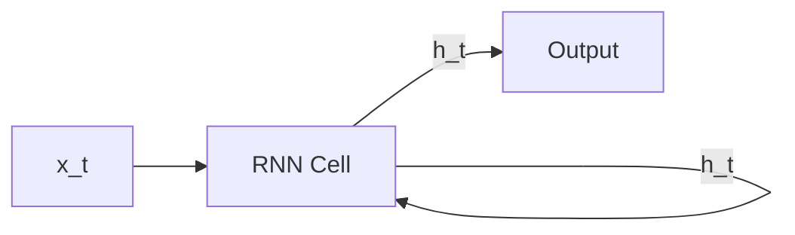
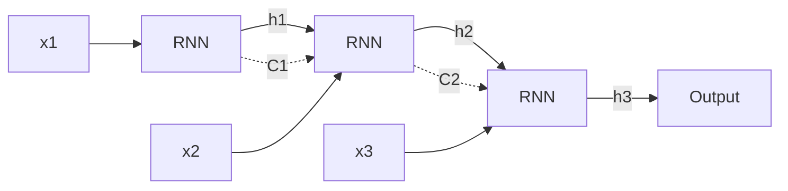
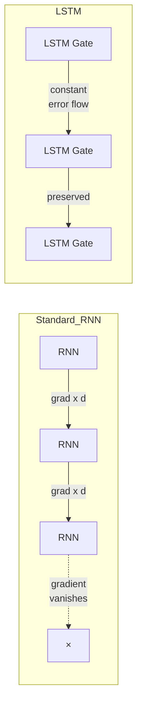
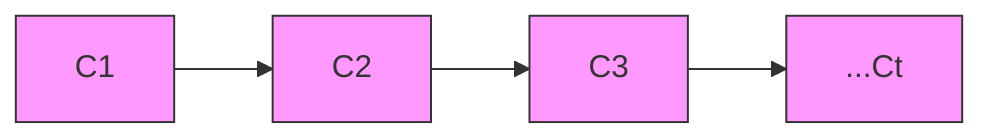
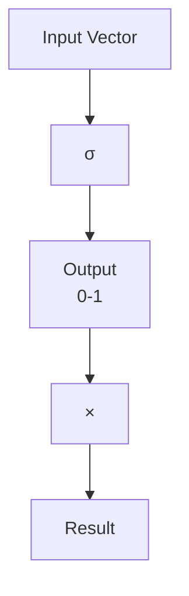
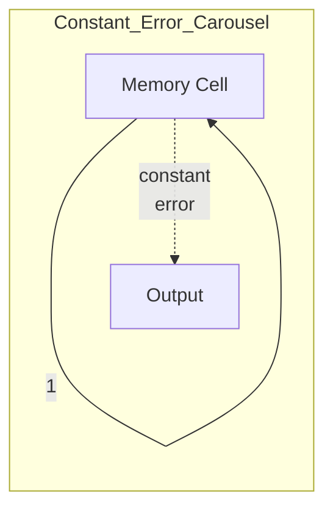
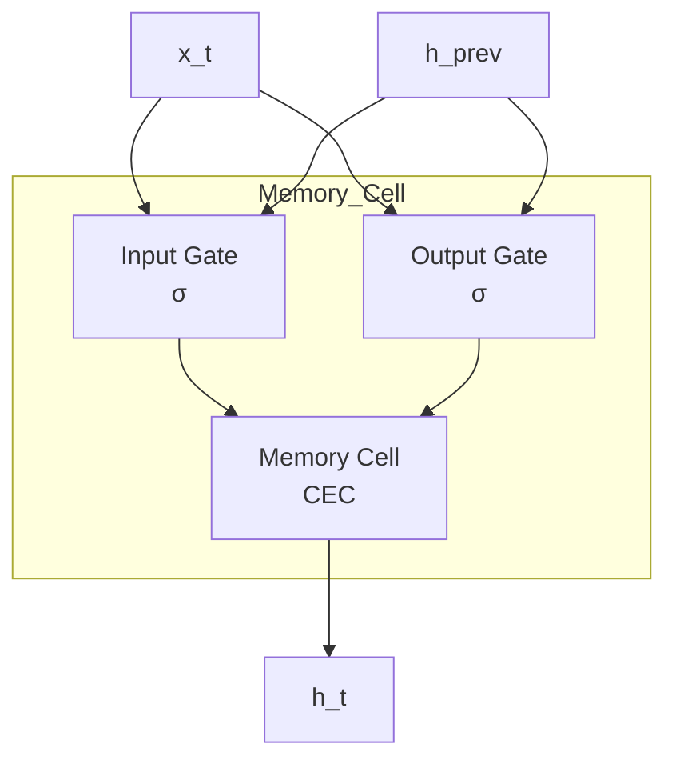
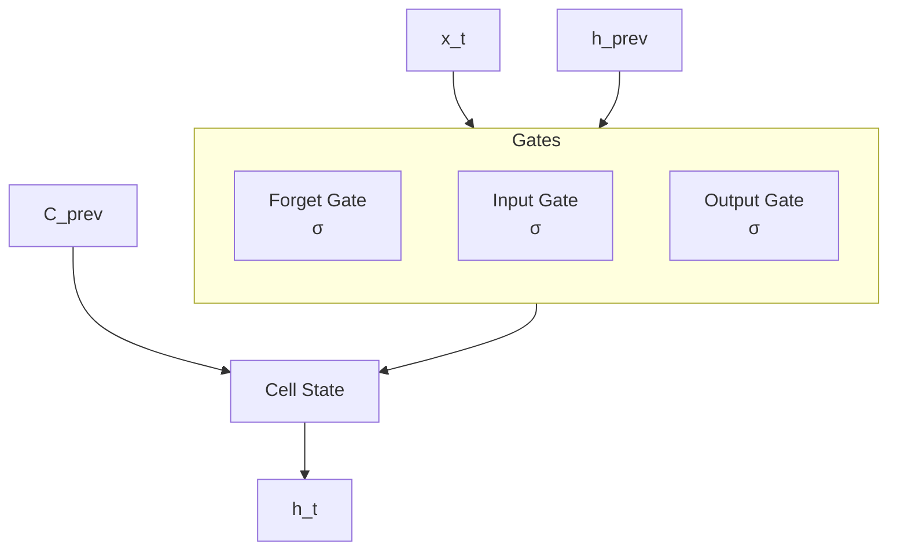
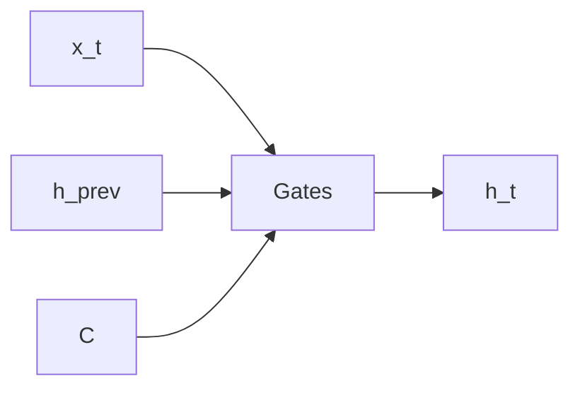
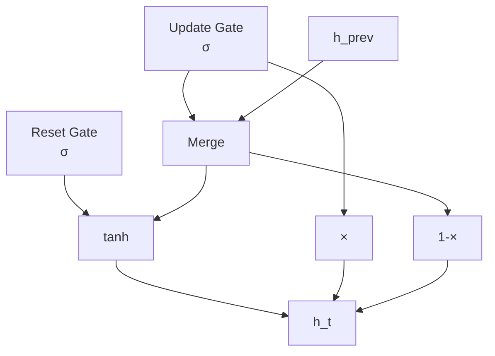

# Understanding LSTM Networks

## Recurrent Neural Networks

Humans don't start their thinking from scratch every second. As you read this essay, you understand each word based on your understanding of previous words. You don't throw everything away and start thinking from scratch again. Your thoughts have persistence.

Traditional neural networks can't do this, and it seems like a major shortcoming. For example, imagine you want to classify what kind of event is happening at every point in a movie. It's unclear how a traditional neural network could use its reasoning about previous events in the film to inform later ones.

Recurrent neural networks address this issue. They are networks with loops in them, allowing information to persist.



In the above diagram, a chunk of neural network, $A$, looks at some input $x_t$ and outputs a value $h_t$. A loop allows information to be passed from one step of the network to the next. If we unroll this loop:



This chain-like nature reveals that RNNs are intimately related to sequences and lists. They're the natural architecture of neural network to use for such data.

And they certainly are used! In the last few years, there have been incredible success applying RNNs to a variety of problems: speech recognition, language modeling, translation, image captioning... The list goes on.

Essential to these successes is the use of "LSTMs," a very special kind of recurrent neural network which works, for many tasks, much much better than the standard version. Almost all exciting results based on recurrent neural networks are achieved with them.

### The Problem of Long-Term Dependencies

One of the appeals of RNNs is the idea that they might be able to connect previous information to the present task, such as using previous video frames might inform the understanding of the present frame. If RNNs could do this, they'd be extremely useful. But can they? It depends.

Sometimes, we only need to look at recent information to perform the present task. For example, consider a language model trying to predict the next word based on the previous ones. If we are trying to predict the last word in "the clouds are in the sky," we don't need any further context – it's pretty obvious the next word is going to be sky. In such cases, where the gap between the relevant information and the place that it's needed is small, RNNs can learn to use the past information.

But there are also cases where we need more context. Consider trying to predict the last word in the text "I grew up in France… I speak fluent French." Recent information suggests that the next word is probably the name of a language, but if we want to narrow down which language, we need the context of France, from further back. It's entirely possible for the gap between the relevant information and the point where it is needed to become very large.

Unfortunately, as that gap grows, RNNs become unable to learn to connect the information.

In theory, RNNs are absolutely capable of handling such "long-term dependencies." A human could carefully pick parameters for them to solve toy problems of this form. Sadly, in practice, RNNs don't seem to be able to learn them. The problem was explored in depth by Hochreiter (1991) and Bengio, et al. (1994), who found some pretty fundamental reasons why it might be difficult.

** Thankfully, LSTMs don't have this problem!**

## LSTM Networks (Colah's Explanation)

Long Short Term Memory networks – usually just called "LSTMs" – are a special kind of RNN, capable of learning long-term dependencies. They were introduced by Hochreiter & Schmidhuber (1997), and were refined and popularized by many people in following work. They work tremendously well on a large variety of problems, and are now widely used.

LSTMs are explicitly designed to avoid the long-term dependency problem. Remembering information for long periods of time is practically their default behavior, not something they struggle to learn!

All recurrent neural networks have the form of a chain of repeating modules of neural network. In standard RNNs, this repeating module will have a very simple structure, such as a single tanh layer.

Essential to these successes is the use of "LSTMs," a very special kind of recurrent neural network which works, for many tasks, much much better than the standard version. Almost all exciting results based on recurrent neural networks are achieved with them.
### The Problem of Long-Term Dependencies
One of the appeals of RNNs is connecting previous information to the present task. Sometimes this works well - if we're predicting the next word in "the clouds are in the sky", we just need the recent context. But consider "I grew up in France... I speak fluent French" - here we need context from much earlier. As this gap grows, RNNs become unable to learn to connect the information.
The problem: with conventional backpropagation through time (BPTT) or real-time recurrent learning (RTRL), error signals flowing backward in time tend to **exponentially decay** depending on the size of the weights. This is the vanishing gradient problem.



LSTMs also have this chain like structure, but the repeating module has a different structure. Instead of having a single neural network layer, there are four, interacting in a very special way.

### The Core Idea Behind LSTMs (Cell State)

The key to LSTMs is the **cell state**, the horizontal line running through the top of the diagram.



The cell state is kind of like a conveyor belt. It runs straight down the entire chain, with only some minor linear interactions. It's very easy for information to just flow along it unchanged.

The LSTM does have the ability to remove or add information to the cell state, carefully regulated by structures called **gates**.

### Gate Mechanism

Gates are a way to optionally let information through. They are composed out of a sigmoid neural net layer and a pointwise multiplication operation.



The sigmoid layer outputs numbers between zero and one, describing how much of each component should be let through. A value of zero means "let nothing through," while a value of one means "let everything through!"

An LSTM has three of these gates, to protect and control the cell state.

### Step-by-Step LSTM Walk Through

**Step 1: Forget Gate** - The first step is to decide what information we're going to throw away from the cell state. This decision is made by a sigmoid layer called the "forget gate layer." It looks at $h_{t-1}$ and $x_t$, and outputs a number between 0 and 1 for each number in the cell state $C_{t-1}$. A 1 represents "completely keep this" while a 0 represents "completely get rid of this."

In a language model trying to predict the next word, the cell state might include the gender of the present subject, so that the correct pronouns can be used. When we see a new subject, we want to forget the gender of the old subject.

$$f_t = \sigma(W_f \cdot [h_{t-1}, x_t] + b_f)$$

**Step 2: Input Gate** - The next step is to decide what new information we're going to store in the cell state. This has two parts. First, a sigmoid layer called the "input gate layer" decides which values we'll update. Next, a tanh layer creates a vector of new candidate values, $\tilde{C}_t$, that could be added to the state.

In the language model, we'd want to add the gender of the new subject to the cell state, to replace the old one we're forgetting.

$$i_t = \sigma(W_i \cdot [h_{t-1}, x_t] + b_i)$$
$$\tilde{C}_t = \tanh(W_C \cdot [h_{t-1}, x_t] + b_C)$$

**Step 3: Update Cell State** - It's now time to update the old cell state, $C_{t-1}$, into the new cell state $C_t$. We multiply the old state by $f_t$, forgetting the things we decided to forget earlier. Then we add $i_t * \tilde{C}_t$. This is the new candidate values, scaled by how much we decided to update each state value.

$$C_t = f_t \cdot C_{t-1} + i_t \cdot \tilde{C}_t$$

**Step 4: Output Gate** - Finally, we need to decide what we're going to output. This output will be based on our cell state, but will be a filtered version. First, we run a sigmoid layer which decides what parts of the cell state we're going to output. Then, we put the cell state through tanh (to push the values to be between -1 and 1) and multiply it by the output of the sigmoid gate, so that we only output the parts we decided to.

For the language model, since it just saw a subject, it might want to output information relevant to a verb, in case that's what is coming next. For example, it might output whether the subject is singular or plural, so that we know what form a verb should be conjugated into.

$$o_t = \sigma(W_o \cdot [h_{t-1}, x_t] + b_o)$$
$$h_t = o_t \cdot \tanh(C_t)$$

---

## [LSTM Networks (Original Paper: Hochreiter & Schmidhuber 1997)](https://www.bioinf.jku.at/publications/older/2604.pdf)

Long Short Term Memory networks (LSTMs) were introduced to solve this problem. The key insight from the original paper:

> "LSTM can learn to bridge minimal time lags in excess of 1000 discrete-time steps by enforcing **constant error flow** through **constant error carousels** within special units."

### The Core Innovation: Constant Error Carousel (CEC)

The original LSTM paper introduced a mechanism to solve the vanishing gradient problem:

1. **Memory Cells**: Special units that maintain error gradients over long time periods
2. **Constant Error Carousel**: Error signals circulate within memory cells without being multiplied by derivatives

For constant error flow through a unit $j$:
$$
f'_j(net_j(t)) \cdot w_{jj} = 1
$$

This is achieved by using the **identity function** $f_j(x) = x$ and setting $w_{jj} = 1.0$.



### Gate Units (Original 1997 Architecture)

The original LSTM had **two gates** (not three - forget gate was added later in 2000):

**1. Input Gate** - Controls what new information enters the memory cell:
$$
in(t) = \sigma(W_{in} \cdot [x(t), h(t-1)] + b_{in})
$$

**2. Output Gate** - Controls what information is sent to the rest of the network:
$$
out(t) = \sigma(W_{out} \cdot [x(t), h(t-1)] + b_{out})
$$

The **multiplicative gate units** learn to open and close access to the constant error flow:



### Why Gates Solve Vanishing Gradients

1. Gates use **multiplicative units** that can pass gradients unchanged (when open = 1)
2. Gradient doesn't decay exponentially through time when gate is "open"
3. Network can learn to store info for 1000+ time steps
4. Computational complexity per time step: $O(W)$ - LSTM is local in space and time

---

## Modern LSTM (with Forget Gate)

The most common LSTM architecture adds a **forget gate** (Gers & Schmidhuber 2000):



**Step 1: Forget Gate** - Decides what to throw away:
$$
f_t = \sigma(W_f \cdot [h_{t-1}, x_t] + b_f)
$$

**Step 2: Input Gate** - Decides what new info to store:
$$
i_t = \sigma(W_i \cdot [h_{t-1}, x_t] + b_i)
$$
$$
\tilde{C}_t = \tanh(W_C \cdot [h_{t-1}, x_t] + b_C)
$$

**Step 3: Update Cell State**:
$$
C_t = f_t \cdot C_{t-1} + i_t \cdot \tilde{C}_t
$$

**Step 4: Output Gate** - Decides what to output:
$$
o_t = \sigma(W_o \cdot [h_{t-1}, x_t] + b_o)
$$
$$
h_t = o_t \cdot \tanh(C_t)
$$

Where sigmoid: $\sigma(x) = \frac{1}{1 + e^{-x}}$ (outputs 0-1)

```mermaid
flowchart LR
    subgraph Step1_Forget
        F1[h_{t-1}, x_t] --> F2[σ] --> F3[f_t]
    end
    
    subgraph Step2_Input
        I1[h_{t-1}, x_t] --> I2[σ] --> I3[i_t]
        I1 --> I4[tanh] --> I5[C̃_t]
    end
    
    subgraph Step3_Update
        C_prev[C_{t-1}] --> Mul1[×] --> C_new[C_t]
        F3 --> Mul1
        I3 & I5 --> Add[+] --> Mul1
    end
    
    subgraph Step4_Output
        I1 --> O1[σ] --> O2[o_t]
        C_new --> O3[tanh] --> O4[×] --> O5[h_t]
        O2 --> O4
    end
```

---

## Variants on Long Short Term Memory (Colah's Explanation)

What I've described so far is a pretty normal LSTM. But not all LSTMs are the same as the above. In fact, it seems like almost every paper involving LSTMs uses a slightly different version. The differences are minor, but it's worth mentioning some of them.

**Peephole Connections** (Gers & Schmidhuber 2000): One popular LSTM variant is adding "peephole connections." This means that we let the gate layers look at the cell state.



The above diagram adds peepholes to all the gates, but many papers will give some peepholes and not others.

**Coupled Forget and Input Gates**: Another variation is to use coupled forget and input gates. Instead of separately deciding what to forget and what we should add new information to, we make those decisions together. We only forget when we're going to input something in its place. We only input new values to the state when we forget something older.

$$C_t = (1-i_t) \cdot C_{t-1} + i_t \cdot \tilde{C}_t$$

**Gated Recurrent Unit (GRU)** (Cho et al. 2014): A slightly more dramatic variation on the LSTM is the Gated Recurrent Unit, or GRU. It combines the forget and input gates into a single "update gate." It also merges the cell state and hidden state, and makes some other changes. The resulting model is simpler than standard LSTM models, and has been growing increasingly popular.



These are only a few of the most notable LSTM variants. There are lots of others, like Depth Gated RNNs by Yao, et al. (2015). There's also some completely different approach to tackling long-term dependencies, like Clockwork RNNs by Koutnik, et al. (2014).

Which of these variants is best? Do the differences matter? Greff, et al. (2015) do a nice comparison of popular variants, finding that they're all about the same. Jozefowicz, et al. (2015) tested more than ten thousand RNN architectures, finding some that worked better than LSTMs on certain tasks.

---

## Advantages & Limitations (Original Paper)

### Advantages of LSTM

### Handles Long Time Lags
LSTM can bridge very long time lags in case of problems with noisy, distributed representations, and continuous values. Unlike finite state automata or hidden Markov models, LSTM does not require an a priori choice of a finite number of states - in principle it can deal with unlimited state numbers.

### Generalization
LSTM generalizes well even if the positions of widely separated, relevant inputs in the input sequence do not matter. It quickly learns to distinguish between two or more widely separated occurrences of a particular element, without depending on appropriate short time lag training exemplars.

### No Need for Fine Tuning
There appears to be no need for parameter fine-tuning. LSTM works well over a broad range of parameters such as learning rate, input gate bias and output gate bias. A large learning rate pushes the output gates towards zero, thus automatically countermanding its own negative effects.

### Computational Efficiency
The LSTM algorithm's update complexity per weight and time step is essentially that of BPTT, namely **O(1)**. This is excellent compared to other approaches like RTRL. Unlike full BPTT, LSTM is local in both space and time.

```mermaid
flowchart LR
    subgraph Comparison
        RTRL[RTRL: O(n)] --> LSTM[LSTM: O(1)]
        BPTT[BPTT: O(1)] -.-> LSTM
    end
```

---

## Limitations of LSTM

### Truncated Backprop Limitations
The efficient truncated backprop version of LSTM will not easily solve problems like "strongly delayed XOR" - where the goal is to compute the XOR of two widely separated inputs that previously occurred somewhere in a noisy sequence. The reason: storing only one input won't help reduce the expected error since the task is non-decomposable.

This limitation can be circumvented by using the full gradient (perhaps with additional conventional hidden units), but this is not recommended because:
1. It increases computational complexity
2. Constant error flow through CECs can only be shown for truncated LSTM
3. Experiments show no significant difference to truncated LSTM

### Memory Cell Overhead
Each memory cell block needs two additional units (input and output gate). Compared to standard recurrent nets, this increases the number of weights by at most a factor of 9 in the fully connected case. However, experiments use quite comparable weight numbers for LSTM and competing approaches.

### Feedforward-Net Like Behavior
Due to constant error flow through CECs, LSTM runs into problems similar to feedforward nets seeing the entire input at once. For example, tasks quickly solved by random weight guessing (like the 500-step parity problem) may not work well with truncated LSTM with small weight initializations.

### Discrete Time Step Counting
All gradient-based approaches suffer from practical inability to precisely count discrete time steps. If it makes a difference whether a signal occurred 99 or 100 steps ago, an additional counting mechanism seems necessary. However, easier tasks like distinguishing between 3 and 11 steps do not pose any problems to LSTM. By generating appropriate negative connection between memory cell output and input, LSTM can give more weight to recent inputs and learn decays.

## Conclusion

Earlier, I mentioned the remarkable results people are achieving with RNNs. Essentially all of these are achieved using LSTMs. They really work a lot better for most tasks!

Written down as a set of equations, LSTMs look pretty intimidating. Hopefully, walking through them step by step in this essay has made them a bit more approachable.

LSTMs were a big step in what we can accomplish with RNNs. It's natural to wonder: is there another big step? A common opinion among researchers is: "Yes! There is a next step and it's **attention**!" The idea is to let every step of an RNN pick information to look at from some larger collection of information. For example, if you are using an RNN to create a caption describing an image, it might pick a part of the image to look at for every word it outputs.

Attention isn't the only exciting thread in RNN research. For example, Grid LSTMs by Kalchbrenner, et al. (2015) seem extremely promising. Work using RNNs in generative models – such as Gregor, et al. (2015), Chung, et al. (2015), or Bayer & Osendorfer (2015) – also seems very interesting. The last few years have been an exciting time for recurrent neural networks, and the coming ones promise to only be more so!

---

## Key Equations Summary

| Component | Equation | Purpose |
|-----------|----------|---------|
| Forget Gate | $f_t = \sigma(W_f \cdot [h_{t-1}, x_t] + b_f)$ | Remove irrelevant info |
| Input Gate | $i_t = \sigma(W_i \cdot [h_{t-1}, x_t] + b_i)$ | Add new info |
| Cell State | $C_t = f_t \cdot C_{t-1} + i_t \cdot \tilde{C}_t$ | Long-term memory |
| Output Gate | $h_t = o_t \cdot \tanh(C_t)$ | Filtered output |
